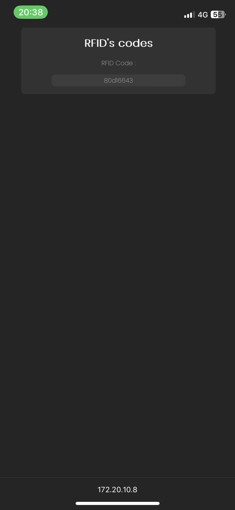

# Práctica 6. Gerard Cots y Joel J. Morera

## Ejercicio practico 1 : Lectura/Escritura de memoria SD

###### **Funcionamiento**

En este ejercicio se hace uso de una memoria SD mediante un bus de comunicación SPI. Para ello, una vez inicializada la memoria SD, definimos un objeto donde se guarda el contenido del fichero que queramos leer y, si efectivamente existe, lo abrimos y lo leemos por el puerto serie. Finalmente, cerramos el fichero.

###### **Código del programa**

```cpp
#include <SPI.h>
#include <SD.h>

File myFile;

void setup()
{
  Serial.begin(115200);

  Serial.print("Iniciando SD ...");
  if (!SD.begin(4))
  {
    Serial.println("No se pudo inicializar");
    return;
  }
  Serial.println("inicializacion exitosa");
 
  myFile = SD.open("archivo.txt");//abrimos  el archivo 
  if (myFile)
  {
    Serial.println("archivo.txt:");
    while (myFile.available()) 
    {
    	Serial.write(myFile.read());
    }
    myFile.close(); //cerramos el archivo
  } 
  else 
  {
    Serial.println("Error al abrir el archivo");
  }
}

void loop() {}
```

###### **Salida del puerto serie**

```
Iniciando SD ...inicializacion exitosa
archivo.txt:
hola mundo
```

***

## Ejercicio practico 2 : Lectura de etiqueta RFID

###### **Funcionamiento**

En este ejercicio se hace uso de un lector de etiquetas RFID mediante un bus de comunicación SPI. Para ello, primero creamos el objeto para el lector definiendo el pin para seleccionar el dispositivo y el pin de reset. En la configuración iniciamos tanto el bus SPI como el lector MFRC522.

En el bucle principal, comprovamos en cada iteración si hay nuevas targetas presentes, en caso afirmativo, seleccionamos la targeta, lo sacamos por pantalla y liberamos la lectura de la targeta. 

###### **Código del programa**

- platformio.ini:

```
[env:esp32doit-devkit-v1]
platform = espressif32
board = esp32doit-devkit-v1
framework = arduino
monitor_speed = 115200
monitor_port = /dev/ttyUSB0
lib_deps = miguelbalboa/MFRC522 @ ^1.4.10
```

- main.cpp:

```cpp
#include <Arduino.h>
#include <SPI.h>
#include <MFRC522.h>

#define RST_PIN	27   //Pin 27 para el reset del RC522
#define SS_PIN	5   //Pin 5 para el SS (SDA) del RC522
MFRC522 mfrc522(SS_PIN, RST_PIN); //Creamos el objeto para el RC522

void setup() 
{
	Serial.begin(115200); //Iniciamos la comunicación  serial
	SPI.begin();        //Iniciamos el Bus SPI
	mfrc522.PCD_Init(); // Iniciamos  el MFRC522
	Serial.println("Lectura del UID");
}

void loop()
{
	// Revisamos si hay nuevas tarjetas  presentes
	if ( mfrc522.PICC_IsNewCardPresent()) 
    {  
        //Seleccionamos una tarjeta
        if ( mfrc522.PICC_ReadCardSerial()) 
        {
            // Enviamos serialemente su UID
            Serial.print("Card UID:");
            for (byte i = 0; i < mfrc522.uid.size; i++) 
            {
                    Serial.print(mfrc522.uid.uidByte[i] < 0x10 ? " 0" : " ");
                    Serial.print(mfrc522.uid.uidByte[i], HEX);   
            } 
            Serial.println();
            // Terminamos la lectura de la tarjeta  actual
            mfrc522.PICC_HaltA();         
        }      
	}	
}
```

###### **Salida del puerto serie**

Paragraph

```
Lectura del UID
Card UID: 80 D1 66 43
Card UID: D3 A6 4A 06
Card UID: 33 01 95 06
[...]
```

###### **Montaje**


***

## Ejercicios de subida de nota

### Ejercicio de subida de nota. Parte 1 : Lectura de codigos RFID y escritura en memoria SD

###### **Funcionamiento**

En este ejercicio se hace uso de un lector de etiquetas RFID mediante un bus de comunicación SPI. Para ello, primero creamos el objeto para el lector y otro objeto para el archivo donde escribiermos los codigos RFID que sean leídos. En la configuración iniciamos el bus SPI, el lector MFRC522 y el lector SD.

En el bucle principal, comprovamos en cada iteración si hay nuevas targetas presentes, en caso afirmativo, seleccionamos la targeta, lo sacamos por pantalla y escribimos la lectura en la targeta. Para obtener cada uno de los codigos RFID primero comporvamos que hayan nuevas tarjetas presentes, en caso afirmativo, seleccionamos la tarjeta y la leemos. Una vez leío el codigo, obtenemos un timepo símbolico con la función `act_time()` que acompañara los codigos cuando sean escritos en el fichero.


###### **Código del programa**

-platformio.ini :

```
[env:esp32doit-devkit-v1]
platform = espressif32
board = esp32doit-devkit-v1
framework = arduino
monitor_speed = 115200
monitor_port = /dev/ttyUSB0
lib_deps = miguelbalboa/MFRC522 @ ^1.4.10
```

- main.cpp :

```cpp
#include <SPI.h>
#include <SD.h>
#include <MFRC522.h>

#define RST_PIN	27    //Pin 27 para el reset del RC522
#define SS_PIN	5   //Pin 5 para el SS (SDA) del RC522
MFRC522 mfrc522(SS_PIN, RST_PIN); //Creamos el objeto para el RC522

File myFile;
String message;
int sec, m;

void getNewCards();
void initSD();
void writeCodes();
String act_time();

void setup() 
{
	Serial.begin(115200); //Iniciamos la comunicación  serial
	SPI.begin();        //Iniciamos el Bus SPI
	mfrc522.PCD_Init(); // Iniciamos  el MFRC522
	Serial.println("Lectura del UID");
  initSD();
}

void loop()
{
    if(getNewCards())writeCodes();
}

void initSD()
{
    Serial.print("Iniciando SD ...");
    if (!SD.begin(4))
    {
      Serial.println("No se pudo inicializar");
      return;
    }
    Serial.println("Inicializacion exitosa");
    
    myFile = SD.open("/archive.log");//abrimos  el archivo 
}

void writeCodes()
{
  if (myFile)
  {
    while (myFile.available()) 
    {
      String ln = "Time: " + act_time() + " - Card UID: " + message ;
      if(myFile.print(ln))Serial.print("Escritura exitosa!");
      message = "";
    }
  } 
  else 
  {
      Serial.println("Error al abrir el archivo");
  }
}

String act_time()
{
  sec+=15;
  if(sec >= 60)m++;
  String ret = "19:";
  if(m < 10)ret = "0" + m;
  else ret+=m;
  ret = ret + ":";
  if(sec < 10)ret = "0" + sec;
  else ret = ret + sec;
  return ret;
}

bool getNewCards()
{
    // Revisamos si hay nuevas tarjetas  presentes
	if ( mfrc522.PICC_IsNewCardPresent()) 
  {  
    //Seleccionamos una tarjeta
    if ( mfrc522.PICC_ReadCardSerial()) 
    {
      // Enviamos serialemente su UID
      Serial.print("Card UID:");
      for (byte i = 0; i < mfrc522.uid.size; i++) 
      {
        message = message + String(mfrc522.uid.uidByte[i],HEX);
        Serial.print(mfrc522.uid.uidByte[i] < 0x10 ? " 0" : " ");
        Serial.print(mfrc522.uid.uidByte[i], HEX);
      } 
      Serial.println();
      // Terminamos la lectura de la tarjeta  actual
      mfrc522.PICC_HaltA();         
      return true;
    }      
	}
}
```

###### **Salida del puerto serie**

```
Lectura del UID
Inciando SD ...Inicializacion exitosa
Card UID: 80 D1 66 43
Card UID: D3 A6 4A 06
Card UID: 33 01 95 06
[...]
```

###### **Fichero de la memoria SD**

```
Time: 19:00:15 - Card UID: 80D16643
Time: 19:00:30 - Card UID: D3A64A06
Time: 19:00:45 - Card UID: 33019506
Time: 19:01:00 - Card UID: 33019506
Time: 19:01:15 - Card UID: 33019506
[...]
```

###### **Montaje**


***

### Ejercicio de subida de nota. Parte 2 : Página web donde se pueda consultar la lectura del lector RFID

###### **Funcionamiento**

En este ejercicio se describe un programa que mediante el uso de *websockets* se establece una comunicación entre el ESP32 y los posibles clientes. Para ello se hace uso de la libereia `ESPAsyncWebServer.h` que nos permite definir un socket en el puerto 80 y, junto con el codigo en *javascript* de la pagina web, leer los datos enviados y mostrarlos.

El codigo funciona de la siguiente manera:

- Se inicializan el bus de comuniación SPI, el lector de targeta RFID, el servidor, la conexión WiFi y el sistema de ficheros del ESP32, que es donde se guarda el código de la pagina web( que se encuntra en `data/index.html`). Además, se define una función que se encarga de describir, en caso de que suceda un evento, que es lo que se debe hacer. En este caso, se define que cuando se conecte un cliente, se escriba por el puerto serie que se ha conectado un cliente y se asigne a la variable `globalClient` al cliente que se ha conectado. En caso contrario, que el cliente se desconnecte se escibe por pantalla que se ha desconectado y se asigna a la variable `globalClient` el valor *NULL*.

- Se define una función que se encarga de leer las nuevas targetas que se detecten. En caso de nuevas targetas, la función devuelve *True* y se envia un mensaje al cliente.


###### **Código del programa**

- platformio.ini:

```
[env:esp32doit-devkit-v1]
platform = espressif32
board = esp32doit-devkit-v1
framework = arduino
monitor_speed = 115200
monitor_port = /dev/ttyUSB0
lib_deps =  miguelbalboa/MFRC522 @ ^1.4.10
            ottowinter/ESPAsyncWebServer-esphome @ ^3.0.0
```

- main.cpp:

```cpp
#include <SPI.h>
#include <MFRC522.h>
#include "WiFi.h"
#include "SPIFFS.h"
#include "ESPAsyncWebServer.h"

//Server vars.
const char* ssid = "*****";
const char* password =  "******";
 
AsyncWebServer server(80);
AsyncWebSocket ws("/ws");
 
AsyncWebSocketClient * globalClient = NULL;
 
String  message;  // Var. Message

#define RST_PIN	27    //Pin 27 para el reset del RC522
#define SS_PIN	5   //Pin 5 para el SS (SDA) del RC522
MFRC522 mfrc522(SS_PIN, RST_PIN); //Creamos el objeto para el RC522

//Function declaration
void getNewCards();
void onWsEvent(AsyncWebSocket * server, AsyncWebSocketClient * client, AwsEventType type, void * arg, uint8_t *data, size_t len);
void initSPIFFS();
void initWiFi();
void initServer();

void setup() 
{
	Serial.begin(115200); //Iniciamos la comunicación  serial
	SPI.begin();        //Iniciamos el Bus SPI
	mfrc522.PCD_Init(); // Iniciamos  el MFRC522
	Serial.println("Lectura del UID");
    initSPIFFS();
    initWiFi();
    initServer();
}

void loop()
{
    if(globalClient != NULL && globalClient->status() == WS_CONNECTED && getNewCards())
    {
        globalClient -> text(message);
        message = "";
    }
}

bool getNewCards()
{
  // Revisamos si hay nuevas tarjetas  presentes
	if ( mfrc522.PICC_IsNewCardPresent()) 
  {  
  	//Seleccionamos una tarjeta
    if ( mfrc522.PICC_ReadCardSerial()) 
    {
      // Enviamos serialemente su UID
      Serial.print("Card UID:");
      for (byte i = 0; i < mfrc522.uid.size; i++) 
      {
        message = message + String(mfrc522.uid.uidByte[i],HEX);
        Serial.print(mfrc522.uid.uidByte[i] < 0x10 ? " 0" : " ");
        Serial.print(mfrc522.uid.uidByte[i], HEX);   
      } 
      Serial.println();
      // Terminamos la lectura de la tarjeta  actual
      mfrc522.PICC_HaltA();
      return true;         
    }      
	}
}
//Server functions
void initSPIFFS()
{
  if(!SPIFFS.begin()){
     Serial.println("An Error has occurred while mounting SPIFFS");
     for(;;);
  }
}

void initWiFi()
{
  WiFi.begin(ssid, password);
 
  Serial.print("Connecting to WiFi..");
  while (WiFi.status() != WL_CONNECTED) {
    delay(1000);
    Serial.print(".");
  }

  Serial.println("");
  Serial.println("IP: ");
  Serial.print(WiFi.localIP());
  Serial.println("");
}

void initServer()
{
  ws.onEvent(onWsEvent);
  server.addHandler(&ws);
 
  server.on("/", HTTP_GET, [](AsyncWebServerRequest *request){
    request->send(SPIFFS, "/index.html", "text/html");
  });
 
  server.begin();
}

void onWsEvent(AsyncWebSocket * server, AsyncWebSocketClient * client, AwsEventType type, void * arg, uint8_t *data, size_t len)
{
 
  if(type == WS_EVT_CONNECT){
 
    Serial.println("Websocket client connection received");
    globalClient = client;
 
  } else if(type == WS_EVT_DISCONNECT){
 
    Serial.println("Websocket client connection finished");
    globalClient = NULL;
 
  }
}
```

###### **Salida del puerto serie**

Paragraph

```
Lectura del UID
Connecting to WiFi....
IP:
172.20.10.8
Websocket client connection recived
Card UID: 80 D1 66 43
Card UID: D3 A6 4A 06
Card UID: 33 01 95 06
[...]

```

###### **Visualización de la página web**

- Página web:



- Código HTML:

```html
<!DOCTYPE html>
<html class="no-js" lang ='es'>
    <head>
        <meta charset='utf-8'>
        <title>Heart Rate & SPO2</title>
        <link rel='preconnect' href='https://fonts.googleapis.com'>
        <link rel='preconnect' href='https://fonts.gstatic.com' crossorigin>
        <link href='https://fonts.googleapis.com/css2?family=Poppins:wght@200&display=swap' rel='stylesheet'>
        <script type="text/javascript">
            var ws = new WebSocket("ws://" + location.hostname + "/ws");

            ws.onopen = function() {
                console.log("WebSocket connected");
            };

            ws.onmessage = function(evt) {
                var raw = evt.data;
                document.getElementById("RFID").innerHTML = raw;
            };

            ws.onerror = function (error) {
                console.log("WebSocket Error ", error);
            };

            ws.onclose = function(){
                console.log("WebSocket connection closed");
            }
        </script>
    </head>
    <style>
        html{
            display: inline-block;
            margin: 1px auto;
            text-align: center;
        }
        body{
            background-color: #252525;
            color: #c1bbbb;
            font: 200 22px 'Poppins',sans-serif
        }
        h1{
            color: #ffffff;
            font-size: 36px;
            text-align: center;
        }
        p{
            text-align: center;
        }
        div{
            background-color: #6a676734;
            border-radius: 15px;
            margin: 2% 15% 2% 15%;
            padding: 0.5%;
        }
    </style>
            
    <body>
        <div>
            <h1>RFID's codes</h1>
            <p>RFID Code : <div id="RFID">---</div></p>
        </div>
    </body>
</html>
```

> **Nota:** Se puede ver un video de la actualización de los datos en tiempo real en `images/web_rfid.mov`

###### **Montaje**


